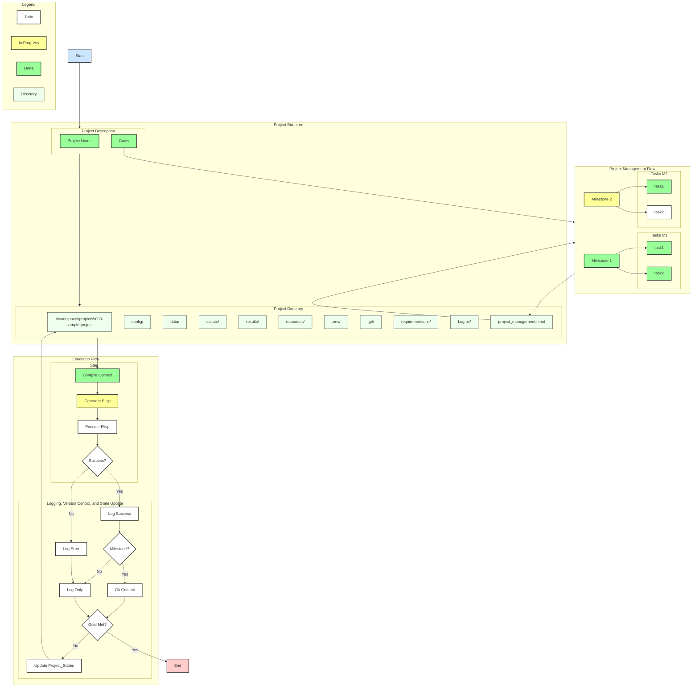

<!-- ---
!-- Timestamp: 2025-05-17 07:14:30
!-- Author: ywatanabe
!-- File: /ssh:ywatanabe@sp:/home/ywatanabe/.dotfiles/.claude/to_claude/guidelines/guidelines_project_management_rules.md
!-- --- -->

## Project Planning Rules
Original project plan should be located at `./project_management/ORIGINAL_PLAN.md`
- Usually, this original plan file is created by me. DO NOT EDIT THIS FILE.
- However, if I explicitly ask you to revise, please update and create a new file with version suffix: 
  - e.g, `./project_management/CLAUDE_UPDATED_PLAN_v01.md`

## Contents of Plans
1. Project Description
2. Goals - What is the project for?
3. Milestones - Checkpoints to ultimately achieve goals
4. Tasks - Small steps to achieve each milestone
and more

## Next Steps File as a persistent memory
Use this file for memory across sessions: `./project_management/next_steps.md`

## Project Management Progress Rules
- Direction of the project is managed under `./project_management`:
  - `./project_management/progress.md`
    - Main progress management file. You should update this as project advances.
    - Use tags:
      - TODO
        - Format: [ ] contents
        - For contents that need to be addressed or completed.
      - DONE
        - Format: [x] contents
        - Fill checkbox
        - For contents that have been completed (considered as done by agents).
      - JUSTIFICATION
        - Format: __justification__ | contents
        - References to justify why you determine the contents are DONE
      - ACCEPTED: 
        - Format: __accepted__ | contents
        - For contents accepted by the user.
        - Note: Only users can add or remove this tag.
      - REJECTED:
        - Format: ~~contents~~
        - For contents rejected by the user.
        - Note: Only users can add or remove this tag.
      - SUGGESTION
        - Format: __suggestions__ | contents
        - For contents suggested by agents.


- Supporting files:
  - `./project_management/progress.mmd`
    - Mermaid diagram definition reflecting the current progress (`./project_management/progress.md`)
    - Use tags as well
    - Use TD format
    - Understand the hierarchy and summarize into core elements
    - Too much of details may not be meaningful for visual challenges

  - `./project_management/progress.svg`
    - SVG file created from the mermaid file

  - `./project_management/progress.gif`
    - GIF image created from the SVG file

  - `./project_management/ORIGINAL_PLAN.md`
    - Original plan created by the user
    - DO NOT EDIT THIS FILE

  - `./project_management/next_steps.md`
    - Update this file to keep track of your thoughts across session

## Project Management Progress format

``` org
# +TITLE: Title
# +AUTHOR: ywatanabe
# +DATE: 2025-02-10 14:52:36
# +FILE: path to this file

* Title

| Type | Stat | Description       | User |
|------|------|-------------------|------|
| 🚀 T | [x]  | Potential Title 1 | 👍 A |
|------|------|-------------------|------|
| 🚀 T | [ ]  | Potential Title 2 | 👀 T |


* Goals, Milestones, and Tasks

** 🎯 Goal 1: Description

| Type | Stat | Description                           | User |
|------|------|---------------------------------------|------|
| 🎯 G | [ ]  | Accepted but not completed Goal       | 👍 A |
|------|------|---------------------------------------|------|
| 🏁 M | [ ]  | Accepted but not completed Milestone  | 👍 A |
|------|------|---------------------------------------|------|
| 📋 T | [x]  | Accepted and completed Task           | 👍 A |
|      | [x]  | 📊 `/path/to/data_file.ext`           | 👍 A |
|------|------|---------------------------------------|------|
| 📋 T | [x]  | Not confirmed but completed Task      | 👀 T |
|      | [x]  | 📌 `/path/to/human_readable_file.ext` | 👀 T |
|------|------|---------------------------------------|------|
| ...  |      |                                       |      |


** 🎯 Goal 2: Description

| Type | Stat | Description                           | User |
|------|------|---------------------------------------|------|
| 🎯 G | [ ]  | Goal 2                                | 👍 A |
|------|------|---------------------------------------|------|
| 🏁 M | [x]  | Milestone 1                           | 👍 A |
|------|------|---------------------------------------|------|
| 📋 T | [x]  | Task 1                                | 👍 A |
|      | [x]  | 📌 `/path/to/human_readable_file.ext` | 👍 A |
|------|------|---------------------------------------|------|
| ...  |      |                                       |      |


** 🎯 Goal 3: Description

| Type | Stat | Description             | User |
|------|------|-------------------------|------|
| 🎯 G | [ ]  | Unrealistic Goal 3      | ❌ R |
|------|------|-------------------------|------|
| 🏁 M | [ ]  | Unrealistic Milestone 1 | ❌ R |
|------|------|-------------------------|------|
| 📋 T | [ ]  | Unrealistic Task 1      | ❌ R |
|------|------|-------------------------|------|
| 📋 T | [ ]  | Unrealistic Task 2      | ❌ R |
|------|------|-------------------------|------|
| ...  |      |                         |      |

* Introduction

| Type | Stat | Description  | Direction | User |
|------|------|--------------|-----------|------|
| 🔎 H | [ ]  | Hypothesis 1 | H -> D    | 👍 A |
|------|------|--------------|-----------|------|
| 🔎 H | [ ]  | Hypothesis 2 | D -> H    | 👀 T |
|------|------|--------------|-----------|------|
| ...  |      |              |           |      |

* Methods

** Data

| Type | Stat | Description | User |
|------|------|-------------|------|
| 📊️ D | [x]  | Data 1      | 👍 A |
|------|------|-------------|------|
| 📊 D | [ ]  | Data 2      | ❌ R |
|------|------|-------------|------|
| 📊️ D | [ ]  | Data 3      | 👀 T |
| ...  |      |             |      |

** Tools

| Type | Stat | Description | User |
|------|------|-------------|------|
| 🛠️ T | [x]  | Tool 1      | 👍 A |
|------|------|-------------|------|
| 🛠️ T | [ ]  | Tool 2      | ❌ R |
|------|------|-------------|------|
| 🛠️ T | [ ]  | Tool 3      | 👀 T |
| ...  |      |             |      |


* Suggestions from Agents

| Type | Stat | Description  | User |
|------|------|--------------|------|
| 💡 S | [ ]  | Suggestion 1 | 👀 T |
|------|------|--------------|------|
| 💡 S | [ ]  | Suggestion 2 | 👀 T |
|------|------|--------------|------|
| 💡 S | [ ]  | Suggestion 3 | 👀 T |
| ...  |      |              |      |

* Legend
 
| **Type** | **Meaning**               | **Status** | **Meaning** | **User Status** | **Meaning** |
|--------|-------------------------|----------|-----------|---------------|-----------|
| 🚀 T   | Title                   | [ ]      | TODO      | 👀 T          | To see    |
|--------|-------------------------|----------|-----------|---------------|-----------|
| 🔎 H   | Hypothesis              | [x]      | DONE      | ❌ R          | Rejected  |
|--------|-------------------------|----------|-----------|---------------|-----------|
| 🎯 G   | Goal                    |          |           | 👍 A          | Accepted  |
|--------|-------------------------|----------|-----------|---------------|-----------|
| 🏁 M   | Milestone               |          |           |               |           |
|--------|-------------------------|----------|-----------|---------------|-----------|
| 📋 T   | Task                    |          |           |               |           |
|--------|-------------------------|----------|-----------|---------------|-----------|
| 🛠️ T   | Tool (as Justification) |          |           |               |           |
|--------|-------------------------|----------|-----------|---------------|-----------|
| 📊 D   | Data (as Justification) |          |           |               |           |
|--------|-------------------------|----------|-----------|---------------|-----------|
| 📌 J   | File as Justification   |          |           |               |           |

# EOF
```

### Progress Format
```
* Title

| Type | Stat | Description       | User |
|------|------|-------------------|------|
| 🚀 T | [x]  | Potential Title 1 | 👍 A |
|------|------|-------------------|------|
| 🚀 T | [ ]  | Potential Title 2 | 👀 T |

* Goals, Milestones, and Tasks

** 🎯 Goal 1: Description

| Type | Stat | Description                           | User |
|------|------|---------------------------------------|------|
| 🎯 G | [ ]  | Accepted but not completed Goal       | 👍 A |
|------|------|---------------------------------------|------|
| 🏁 M | [ ]  | Accepted but not completed Milestone  | 👍 A |
|------|------|---------------------------------------|------|
| 📋 T | [x]  | Accepted and completed Task           | 👍 A |
|      | [x]  | 📊 `/path/to/data_file.ext`           | 👍 A |
```

### Legend for Project Management
```
| **Type** | **Meaning**               | **Status** | **Meaning** | **User Status** | **Meaning** |
|--------|-------------------------|----------|-----------|---------------|-----------|
| 🚀 T   | Title                   | [ ]      | TODO      | 👀 T          | To see    |
|--------|-------------------------|----------|-----------|---------------|-----------|
| 🔎 H   | Hypothesis              | [x]      | DONE      | ❌ R          | Rejected  |
|--------|-------------------------|----------|-----------|---------------|-----------|
| 🎯 G   | Goal                    |          |           | 👍 A          | Accepted  |
|--------|-------------------------|----------|-----------|---------------|-----------|
| 🏁 M   | Milestone               |          |           |               |           |
|--------|-------------------------|----------|-----------|---------------|-----------|
| 📋 T   | Task                    |          |           |               |           |
|--------|-------------------------|----------|-----------|---------------|-----------|
| 🛠️ T   | Tool (as Justification) |          |           |               |           |
|--------|-------------------------|----------|-----------|---------------|-----------|
| 📊 D   | Data (as Justification) |          |           |               |           |
|--------|-------------------------|----------|-----------|---------------|-----------|
| 📌 J   | File as Justification   |          |           |               |           |
|--------|-------------------------|----------|-----------|---------------|-----------|
| 💡 S   | Suggestion              |          |           |               |           |
```


## Project Management Progress Example

``` org
# +TITLE: MNIST Digit Classification Project
# +AUTHOR: ywatanabe
# +DATE: 2025-02-10 14:52:36
# +FILE: /home/ywatanabe/proj/llemacs/resources/prompts/components/examples/mgmt-progress.org

* Title

| Type | Stat | Description                        | User |
|------|------|------------------------------------|------|
| 🚀 T | [x]  | *mnist digit clf*                  | 👍 A |
|------|------|------------------------------------|------|
| 🚀 T | [ ]  | *MNIST Digit Classification Project* | 👍 A |


* Goals, Milestones, and Tasks

** 🎯 Goal 1: Prepare and Preprocess Data

| Type | Stat | Description                                  | User |
|------|------|----------------------------------------------|------|
| 🎯 G | [ ]  | Prepare and Preprocess Data                  | 👍 A |
|------|------|----------------------------------------------|------|
| 🏁 M | [x]  | Acquire MNIST Dataset                        | 👍 A |
|------|------|----------------------------------------------|------|
| 📋 T | [x]  | Download MNIST training and testing datasets | 👍 A |
|      | [x]  | 📊 ./data/mnist/                             | 👍 A |
|------|------|----------------------------------------------|------|
| 🏁 M | [ ]  | Preprocess and Augment Data                  | 👀 T |
|------|------|----------------------------------------------|------|
| 📋 T | [ ]  | Normalize pixel values                       | 👀 T |
|      | [ ]  | 📌 ./scripts/mnist/normalization.py          | 👀 T |
|------|------|----------------------------------------------|------|
| 📋 T | [ ]  | Reshape and format data for model input      | 👀 T |
|      | [ ]  | 📌 ./scripts/mnist/reshape.py                | 👀 T |
|------|------|----------------------------------------------|------|
| 📋 T | [ ]  | Perform data augmentation techniques         | 👀 T |
|      | [ ]  | 📌 ./scripts/mnist/data_augmentation.py      | 👀 T |

** 🎯 Goal 2: Develop and Train Baseline CNN Model

| Type | Stat | Description                                                    | User |
|------|------|----------------------------------------------------------------|------|
| 🎯 G | [ ]  | Develop and Train Baseline CNN Model                           | 👍 A |
|------|------|----------------------------------------------------------------|------|
| 🏁 M | [x]  | Design CNN architecture                                        | 👍 A |
|------|------|----------------------------------------------------------------|------|
| 📋 T | [x]  | Define the number of layers and filters                        | 👍 A |
|      | [x]  | 📌 Configuration in `./config/cnn_config.yaml`                 | 👍 A |
|------|------|----------------------------------------------------------------|------|
| 📋 T | [x]  | Select activation functions and pooling strategies             | 👍 A |
|      | [x]  | 📌 Details in `./config/cnn_config.yaml`                       | 👍 A |
|------|------|----------------------------------------------------------------|------|
| 🏁 M | [ ]  | Implement the CNN model in code                                | 👀 T |
|------|------|----------------------------------------------------------------|------|
| 📋 T | [ ]  | Code the model using Keras API                                 | 👀 T |
|      | [ ]  | 📌 Code to be written in `./models/cnn_model.py`               | 👀 T |
|------|------|----------------------------------------------------------------|------|
| 📋 T | [ ]  | Compile the model with appropriate optimizer and loss function | 👀 T |
|------|------|----------------------------------------------------------------|------|
| 📋 T | [ ]  | Train the model on preprocessed MNIST training data            | 👀 T |
|------|------|----------------------------------------------------------------|------|
| 📋 T | [ ]  | Set training parameters (epochs, batch size)                   | 👀 T |
|------|------|----------------------------------------------------------------|------|
| 📋 T | [ ]  | Monitor training progress and adjust as necessary              | 👀 T |

** 🎯 Goal 3: Evaluate Model Performance

| Type | Stat | Description                                         | User |
|------|------|-----------------------------------------------------|------|
| 🎯 G | [ ]  | Evaluate Model Performance                          | 👍 A |
|------|------|-----------------------------------------------------|------|
| 🏁 M | [ ]  | Test the model on MNIST testing data                | 👀 T |
|------|------|-----------------------------------------------------|------|
| 📋 T | [ ]  | Calculate accuracy and loss on test set             | 👀 T |
|------|------|-----------------------------------------------------|------|
| 📋 T | [ ]  | Generate confusion matrix and classification report | 👀 T |


** 🎯 Goal 4: Improve Model Accuracy and Generalization

| Type | Stat | Description                                             | User |
|------|------|---------------------------------------------------------|------|
| 🎯 G | [ ]  | Improve Model Accuracy and Generalization               | 👍 A |
|------|------|-----------------------------------------------------|------|
| 🏁 M | [ ]  | Apply Additional Data Augmentation Techniques           | 💡 S |
|------|------|-----------------------------------------------------|------|
| 📋 T | [ ]  | Implement random rotations, shifts, and flips           | 💡 S |
|      | [ ]  | 📌 Enhances model robustness to variations | 💡 S |
|------|------|-----------------------------------------------------|------|
| 📋 T | [ ]  | Retrain the model with augmented data                   | 💡 S |
|------|------|-----------------------------------------------------|------|
| 🏁 M | [ ]  | Perform Hyperparameter Tuning                           | 💡 S |
|------|------|-----------------------------------------------------|------|
| 📋 T | [ ]  | Adjust learning rates, batch sizes, and optimizer types | 💡 S |
|------|------|-----------------------------------------------------|------|
| 📋 T | [ ]  | Use techniques like grid search or random search        | 💡 S |
|------|------|-----------------------------------------------------|------|
| 🏁 M | [ ]  | Implement Regularization Methods                        | 💡 S |
|------|------|-----------------------------------------------------|------|
| 📋 T | [ ]  | Add dropout layers to prevent overfitting               | 💡 S |
|------|------|-----------------------------------------------------|------|
| 📋 T | [ ]  | Apply L1/L2 regularization to weights                   | 💡 S |

* Introduction

| Type | Stat | Description                                                                                  | User |
|------|------|----------------------------------------------------------------------------------------------|------|
| 🔎 H | [ ]  | Implementing a CNN will achieve over 99% accuracy on MNIST.                                  | 👀 T |
|------|------|----------------------------------------------------------------------------------------------|------|
| 🔎 H | [ ]  | Applying data preprocessing and augmentation will improve model accuracy and generalization. | 👀 T |

* Methods

** Tools

| Type | Stat | Description                                       | User |
|------|------|---------------------------------------------------|------|
| 🛠️ T  | [x]  | Python programming language.                      | 👍 A |
|------|------|---------------------------------------------------|------|
| 🛠️ T  | [x]  | TensorFlow and Keras libraries for deep learning. | 👍 A |
|------|------|---------------------------------------------------|------|
| 🛠️ T  | [ ]  | GPU resources for accelerated training.           | 👀 T |

* Suggestions from Agents

| Type | Stat | Description                                                                                   | User |
|------|------|-----------------------------------------------------------------------------------------------|------|
| 💡 S | [ ]  | Experiment with batch normalization layers to improve training speed and stability.           | 👀 T |
|------|------|-----------------------------------------------------------------------------------------------|------|
| 💡 S | [ ]  | Try deeper network architectures like ResNet or DenseNet for potential accuracy improvements. | 👀 T |
|------|------|-----------------------------------------------------------------------------------------------|------|
| 💡 S | [ ]  | Implement cross-validation to obtain more reliable estimates of model performance.            | 👀 T |

* Legend
 
| **Type** | **Meaning**               | **Status** | **Meaning** | **User Status** | **Meaning** |
|--------|-------------------------|----------|-----------|---------------|-----------|
| 🚀 T   | Title                   | [ ]      | TODO      | 👀 T          | To see    |
|--------|-------------------------|----------|-----------|---------------|-----------|
| 🔎 H   | Hypothesis              | [x]      | DONE      | ❌ R          | Rejected  |
|--------|-------------------------|----------|-----------|---------------|-----------|
| 🎯 G   | Goal                    |          |           | 👍 A          | Accepted  |
|--------|-------------------------|----------|-----------|---------------|-----------|
| 🏁 M   | Milestone               |          |           |               |           |
|--------|-------------------------|----------|-----------|---------------|-----------|
| 📋 T   | Task                    |          |           |               |           |
|--------|-------------------------|----------|-----------|---------------|-----------|
| 🛠️ T   | Tool (as Justification) |          |           |               |           |
|--------|-------------------------|----------|-----------|---------------|-----------|
| 📊 D   | Data (as Justification) |          |           |               |           |
|--------|-------------------------|----------|-----------|---------------|-----------|
| 📌 J   | File as Justification   |          |           |               |           |
```

## Project Management Mermaid Example


## Mermaid Rendering Script
Use `tools/render_mermaid.sh`

## Your Understanding Check
Did you understand the guideline? If yes, please say:
`CLAUDE UNDERSTOOD: <THIS FILE PATH HERE>`

<!-- EOF -->