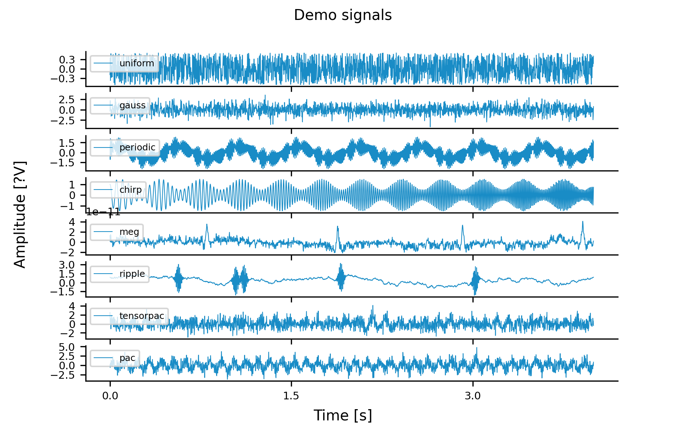
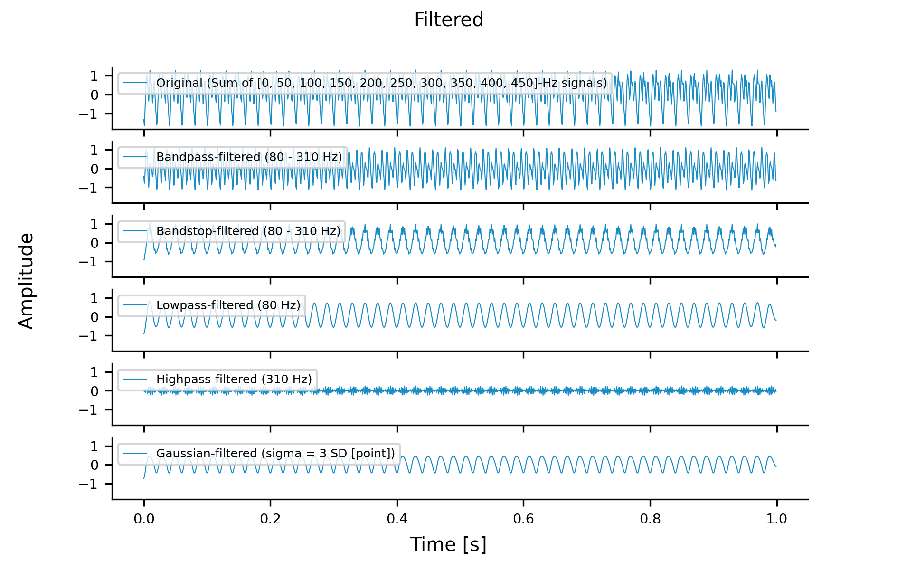
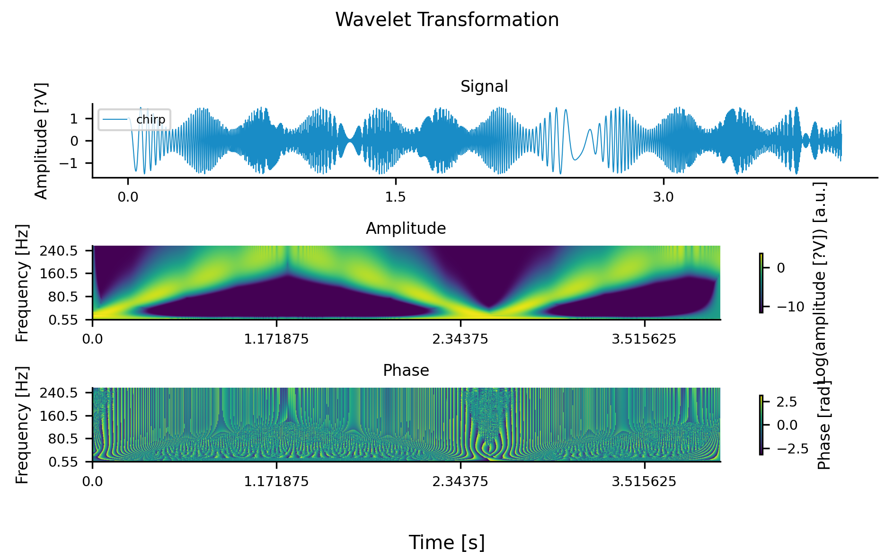
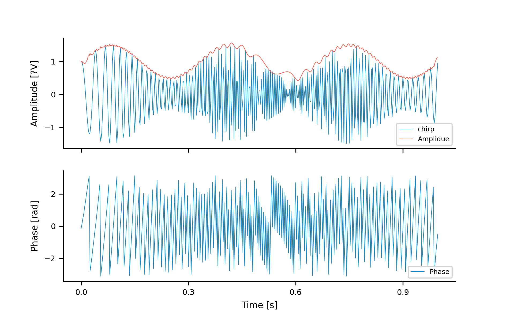
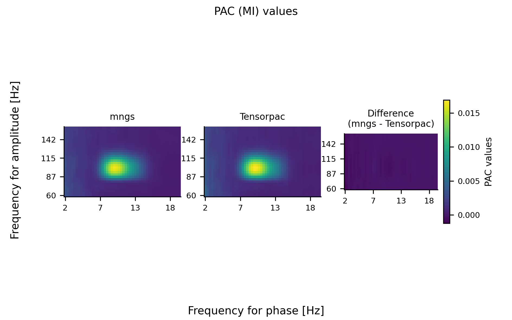
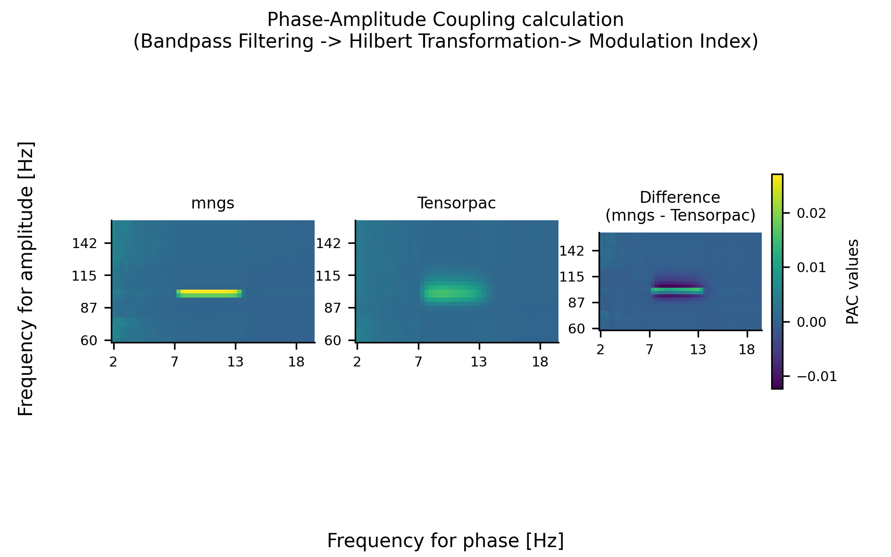

# [`mngs.dsp`](https://github.com/ywatanabe1989/mngs/tree/main/src/mngs/dsp/)

Digital Signal Processing (DSP) utilities written in **PyTorch**, optimized for **CUDA** devices when available, with special attention to parallel computing.

## Introduction

Digital Signal Processing (DSP) is a crucial field in modern data analysis and signal manipulation. It involves the use of digital techniques to analyze, modify, and synthesize signals, which can represent various types of data such as audio, images, or sensor readings. The `mngs.dsp` module provides a powerful set of tools for performing DSP operations efficiently, leveraging the power of PyTorch and GPU acceleration.

## Features

1. **PyTorch-based Implementation**: All calculations are performed using PyTorch, enabling efficient parallel processing and GPU acceleration when available.

2. **Flexible Input Handling**: Accepts **np.array** and **pd.DataFrame** as input, with results returned in numpy format for convenience and consistency.

3. **GPU Optimization**: Automatically utilizes CUDA devices when available for faster processing of large datasets.

4. **Machine Learning Ready**: The `torch.nn.modules` in [`mngs.dsp.nn`](https://github.com/ywatanabe1989/mngs/tree/main/src/mngs/nn/) are designed for seamless integration into machine learning projects.

5. **Comprehensive DSP Toolkit**: Includes a wide range of DSP operations such as filtering, resampling, noise addition, Hilbert transformation, wavelet transformation, and more.

6. **Easy-to-use API**: Designed with simplicity in mind, allowing researchers and developers to focus on their analysis rather than implementation details.

## Installation

```bash
$ pip install mngs
```

## Usage

Here's a more detailed example of how to use various functions in the `mngs.dsp` module:

```python
import mngs
import numpy as np
import matplotlib.pyplot as plt

# Generate a demo signal
t_sec = 10
fs = 1000
freqs_hz = [10, 30, 100]
xx, tt, fs = mngs.dsp.demo_sig(t_sec=t_sec, fs=fs, freqs_hz=freqs_hz, sig_type="chirp")

# Normalize the signal
xx_norm = mngs.dsp.norm.z(xx)

# Apply bandpass filter
low_hz, high_hz = 20, 50
xx_filtered = mngs.dsp.filt.bandpass(xx_norm, fs, low_hz=low_hz, high_hz=high_hz)

# Perform Hilbert transform
phase, amplitude = mngs.dsp.hilbert(xx_filtered)

# Calculate Power Spectral Density
psd, psd_freqs = mngs.dsp.psd(xx_filtered, fs)

# Plot results
fig, axs = plt.subplots(3, 1, figsize=(12, 10))
axs[0].plot(tt, xx_filtered[0, 0, :])
axs[0].set_title('Filtered Signal')
axs[1].plot(tt, amplitude[0, 0, :])
axs[1].set_title('Signal Amplitude (Envelope)')
axs[2].plot(psd_freqs, psd[0, 0, :])
axs[2].set_title('Power Spectral Density')
axs[2].set_xlabel('Frequency (Hz)')
plt.tight_layout()
plt.show()
```

This example demonstrates how to generate a signal, apply filtering, perform Hilbert transform, and calculate the power spectral density using the `mngs.dsp` module.

## Galleries

<div style="display: flex; justify-content: center; flex-wrap: wrap;">
  
  
  
  
</div>

<div style="display: flex; justify-content: center; flex-wrap: wrap;">
  
  
  
  
</div>

## Contributing

Contributions to `mngs.dsp` are welcome! If you'd like to contribute, please follow these steps:

1. Fork the repository
2. Create a new branch for your feature or bug fix
3. Make your changes and write tests if applicable
4. Submit a pull request with a clear description of your changes

Please ensure that your code adheres to the existing style and passes all tests.

## License

This project is licensed under the MIT License. See the [LICENSE](LICENSE) file for details.

## Contact

For any questions or feedback, please contact Yusuke Watanabe (ywata1989@gmail.com).
