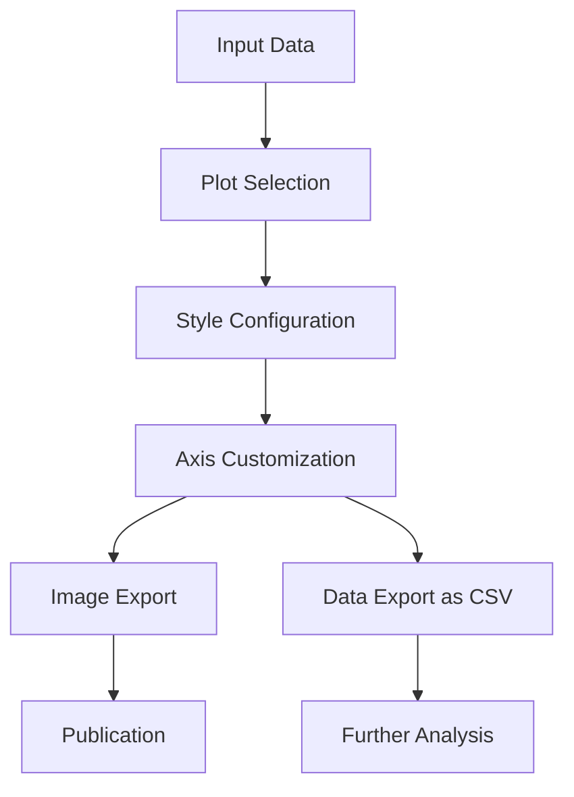

<!-- ---
<<<<<<< HEAD
!-- Timestamp: 2025-06-04 10:33:57
!-- Author: ywatanabe
!-- File: /ssh:ywatanabe@sp:/home/ywatanabe/proj/.claude-worktree/mngs_repo/src/mngs/plt/TODO.md
!-- --- -->

/home/ywatanabe/proj/.claude-worktree/mngs_repo/src/mngs/plt/README.md

This example is already comprehensive. However, could you add all the examples in working code while keeping "EXACTLY ALL THE CODE IN THIS MODULE, mngs.plt"
Also, could you change the layout to allocate each plot type a dedicated block? FOr example,
In the AAB (Arrange-Act-Assert) pattern.


## `ax.plot_raster(spike_times, trial_ids, color='black', marker='|', id='raster')`

fig, ax = plt.subplots()
spike_times = ...
ax.plot(...)
mngs.io.save(fig, "plot_raster_example.gif")


# Matplotlib Enhancement Package Blueprint

## Overview

Comprehensive wrapper for matplotlib with additional visualization capabilities, advanced styling, and data export options.

## Assumptions and Requirements

- Matplotlib compatibility
- Python 3.8+
- Pandas/NumPy integration
- Easy customization for publication-quality plots

## Concerns

- [ ] Maintain compatibility with matplotlib API
- [ ] Handle consistent documentation across modules
- [ ] Test coverage for all visualization tools
- [ ] Standardize parameter naming conventions

## Workflow as Text Diagram

`Data → Plot Selection → Style Customization → Axis Adjustments → Export (Image/CSV)`

## Workflow as Mermaid



## Directory Structure

```
mngs/plt/
├── __init__.py
├── _PARAMS.py
├── _colors.py
├── _configure_mpl.py
├── ax/
│   ├── __init__.py
│   ├── _adjust/
│   │   ├── __init__.py
│   │   ├── _extend.py
│   │   ├── _hide_spines.py
│   │   ├── _rotate_labels.py
│   │   ├── _set_ticks.py
│   │   └── ... (other adjustment functions)
│   └── _plot/
│       ├── __init__.py
│       ├── _plot_shaded_line.py
│       ├── _plot_conf_mat.py
│       └── ... (other specialized plots)
├── _subplots/
│   ├── __init__.py
│   ├── _SubplotsWrapper.py
│   ├── _AxisWrapper.py
│   ├── _export_as_csv.py
│   └── ... (other subplot utilities)
├── utils/
│   ├── __init__.py
│   ├── _im2grid.py
│   ├── _mk_colorbar.py
│   └── ... (other utilities)
└── tests/
    ├── test_colors.py
    ├── test_ax_adjust.py
    ├── test_ax_plot.py
    ├── test_subplots.py
    └── ... (other test files)
```

## Modules and Roles

| Module | Role | Functions |
|--------|------|-----------|
| `colors.py` | Color handling | Color conversion, gradients, palettes |
| `configure_mpl.py` | Configuration | Style setup, defaults, publication settings |
| `ax._adjust` | Axis adjustments | Layout, ticks, spines, appearance |
| `ax._plot` | Specialized plots | Statistical, image, heat maps, scientific plots |
| `_subplots` | Figure management | Plot tracking, data export, wrappers |
| `utils` | Utilities | Image grids, colorbars, patches, helper functions |

## Pros and Cons

| Pros | Cons |
|------|------|
| Matplotlib API compatibility | Complex directory structure |
| Publication-quality defaults | Learning curve for specialized features |
| Data export for analysis | Potential version conflicts with matplotlib |
| Statistical visualization tools | Maintenance overhead with matplotlib updates |
| Consistent styling | Redundancy with some seaborn features |

/home/ywatanabe/proj/mngs_repo/src/mngs/plt/
├── _add_hue.py
├── ax
│   ├── _adjust
│   │   ├── _add_marginal_ax.py
│   │   ├── _add_panel.py
│   │   ├── _extend.py
│   │   ├── _force_aspect.py
│   │   ├── _format_label.py
│   │   ├── _hide_spines.py
│   │   ├── __init__.py
│   │   ├── _map_ticks.py
│   │   ├── __pycache__
│   │   │   ├── _add_marginal_ax.cpython-311.pyc
│   │   │   ├── _add_panel.cpython-311.pyc
│   │   │   ├── _extend.cpython-311.pyc
│   │   │   ├── _force_aspect.cpython-311.pyc
│   │   │   ├── _format_label.cpython-311.pyc
│   │   │   ├── _hide_spines.cpython-311.pyc
│   │   │   ├── __init__.cpython-311.pyc
│   │   │   ├── _map_ticks.cpython-311.pyc
│   │   │   ├── _rotate_labels.cpython-311.pyc
│   │   │   ├── _sci_note.cpython-311.pyc
│   │   │   ├── _set_n_ticks.cpython-311.pyc
│   │   │   ├── _set_size.cpython-311.pyc
│   │   │   ├── _set_supxyt.cpython-311.pyc
│   │   │   ├── _set_ticks.cpython-311.pyc
│   │   │   ├── _set_xyt.cpython-311.pyc
│   │   │   ├── _share_axes.cpython-311.pyc
│   │   │   ├── _share_xy.cpython-311.pyc
│   │   │   └── _shift.cpython-311.pyc
│   │   ├── _rotate_labels.py
│   │   ├── _sci_note.py
│   │   ├── _set_n_ticks.py
│   │   ├── _set_size.py
│   │   ├── _set_supxyt.py
│   │   ├── _set_ticks.py
│   │   ├── _set_xyt.py
│   │   ├── _share_axes.py
│   │   └── _shift.py
│   ├── __init__.py
│   ├── _plot
│   │   ├── __init__.py
│   │   ├── _plot_annotated_heatmap.py
│   │   ├── _plot_circular_hist.py
│   │   ├── _plot_conf_mat.py
│   │   ├── _plot_cube.py
│   │   ├── _plot_ecdf.py
│   │   ├── _plot_fillv.py
│   │   ├── _plot_half_violin.py
│   │   ├── _plot_image.py
│   │   ├── _plot_joyplot.py
│   │   ├── _plot_raster.py
│   │   ├── _plot_rectangle.py
│   │   ├── _plot_shaded_line.py
│   │   ├── _plot_statistical_shaded_line.py
│   │   └── __pycache__
│   │       ├── __init__.cpython-311.pyc
│   │       ├── _plot_annotated_heatmap.cpython-311.pyc
│   │       ├── _plot_circular_hist.cpython-311.pyc
│   │       ├── _plot_conf_mat.cpython-311.pyc
│   │       ├── _plot_cube.cpython-311.pyc
│   │       ├── _plot_ecdf.cpython-311.pyc
│   │       ├── _plot_fillv.cpython-311.pyc
│   │       ├── _plot_half_violin.cpython-311.pyc
│   │       ├── _plot_image2d.cpython-311.pyc
│   │       ├── _plot_image.cpython-311.pyc
│   │       ├── _plot_joyplot.cpython-311.pyc
│   │       ├── _plot_raster.cpython-311.pyc
│   │       ├── _plot_rectangle.cpython-311.pyc
│   │       ├── _plot_shaded_line.cpython-311.pyc
│   │       └── _plot_statistical_shaded_line.cpython-311.pyc
│   └── __pycache__
│       ├── _add_marginal_ax.cpython-311.pyc
│       ├── _circular_hist.cpython-311.pyc
│       ├── _conf_mat.cpython-311.pyc
│       ├── _ecdf.cpython-311.pyc
│       ├── _extend.cpython-311.pyc
│       ├── _fillv.cpython-311.pyc
│       ├── _force_aspect.cpython-311.pyc
│       ├── _format_label.cpython-311.pyc
│       ├── _half_violin.cpython-311.pyc
│       ├── _hide_spines.cpython-311.pyc
│       ├── _imshow2d.cpython-311.pyc
│       ├── __init__.cpython-311.pyc
│       ├── _joyplot.cpython-311.pyc
│       ├── _map_ticks.cpython-311.pyc
│       ├── _panel.cpython-311.pyc
│       ├── _plot_circular_hist.cpython-311.pyc
│       ├── _plot_.cpython-311.pyc
│       ├── _plot_half_violin.cpython-311.pyc
│       ├── _plot_raster.cpython-311.pyc
│       ├── _plot_shaded_line.cpython-311.pyc
│       ├── _plot_statistical_shaded_line.cpython-311.pyc
│       ├── _raster_plot.cpython-311.pyc
│       ├── _rectangle.cpython-311.pyc
│       ├── _rotate_labels.cpython-311.pyc
│       ├── _sci_note.cpython-311.pyc
│       ├── _set_n_ticks.cpython-311.pyc
│       ├── _set_size.cpython-311.pyc
│       ├── _set_supxyt.cpython-311.pyc
│       ├── _set_ticks.cpython-311.pyc
│       ├── _set_xyt.cpython-311.pyc
│       ├── _share_axes.cpython-311.pyc
│       └── _shift.cpython-311.pyc
├── _calc_bacc_from_conf_mat.py
├── _calc_nice_ticks.py
├── _close.py
├── _colors.py
├── _configure_mpl.py
├── get_mpl_color.py
├── _get_RGBA_from_colormap.py
├── _im2grid.py
├── __init__.py
├── _interp_colors.py
├── _mk_colorbar.py
├── _mk_patches.py
├── _PARAMS.py
├── __pycache__
│   ├── _add_hue.cpython-311.pyc
│   ├── _annotated_heatmap.cpython-311.pyc
│   ├── _calc_bacc_from_conf_mat.cpython-311.pyc
│   ├── _calc_nice_ticks.cpython-311.pyc
│   ├── _calculate_nice_ticks.cpython-311.pyc
│   ├── _close.cpython-311.pyc
│   ├── _colors.cpython-311.pyc
│   ├── _configure_mpl.cpython-311.pyc
│   ├── _draw_a_cube.cpython-311.pyc
│   ├── get_mpl_color.cpython-311.pyc
│   ├── _get_RGBA_from_colormap.cpython-311.pyc
│   ├── _grid_image.cpython-311.pyc
│   ├── _im2grid.cpython-311.pyc
│   ├── __init__.cpython-311.pyc
│   ├── _interp_colors.cpython-311.pyc
│   ├── _mk_colorbar.cpython-311.pyc
│   ├── _mk_patches.cpython-311.pyc
│   ├── _PARAMS.cpython-311.pyc
│   ├── _plot_annotated_heatmap.cpython-311.pyc
│   ├── _tpl.cpython-311.pyc
│   └── _vizualize_colors.cpython-311.pyc
├── README.md
├── _subplots
│   ├── _AxesWrapper.py
│   ├── _AxisWrapperMixins
│   │   ├── _AdjustmentMixin.py
│   │   ├── __init__.py
│   │   ├── _MatplotlibPlotMixin.py
│   │   ├── __pycache__
│   │   │   ├── _AdjustmentMixin.cpython-311.pyc
│   │   │   ├── _BasicPlotMixin.cpython-311.pyc
│   │   │   ├── __init__.cpython-311.pyc
│   │   │   ├── _MatplotlibPlotMixin.cpython-311.pyc
│   │   │   ├── _MatplotlibPlotMixin_.cpython-311.pyc
│   │   │   ├── _SeabornMixin.cpython-311.pyc
│   │   │   └── _TrackingMixin.cpython-311.pyc
│   │   ├── _SeabornMixin.py
│   │   └── _TrackingMixin.py
│   ├── _AxisWrapper.py
│   ├── _export_as_csv.py
│   ├── _FigWrapper.py
│   ├── __init__.py
│   ├── __pycache__
│   │   ├── _AxesWrapper.cpython-311.pyc
│   │   ├── _AxisWrapper.cpython-311.pyc
│   │   ├── _export_as_csv.cpython-311.pyc
│   │   ├── _FigWrapper.cpython-311.pyc
│   │   ├── __init__.cpython-311.pyc
│   │   ├── _SubplotsManager.cpython-311.pyc
│   │   ├── _SubplotsWrapper.cpython-311.pyc
│   │   └── _to_sigma.cpython-311.pyc
│   └── _SubplotsWrapper.py
├── TODO.md
├── _tpl.py
└── _vizualize_colors.py

12 directories, 162 files

=======
!-- Timestamp: 2025-05-18 00:17:09
!-- Author: ywatanabe
!-- File: /ssh:sp:/home/ywatanabe/proj/mngs_repo/src/mngs/plt/TODO.md
!-- --- -->

>>>>>>> origin/main
<!-- EOF -->