# mngs.plt Gallery

<table>
<tr>
<td style='text-align: center; padding: 10px;'>
 
test__im2grid_test_single_image.jpg
</td>
<td style='text-align: center; padding: 10px;'>
 
test__im2grid_test_custom_default_color.jpg
</td>
<td style='text-align: center; padding: 10px;'>
 
test__im2grid_test_grid_image.jpg
</td>
<td style='text-align: center; padding: 10px;'>
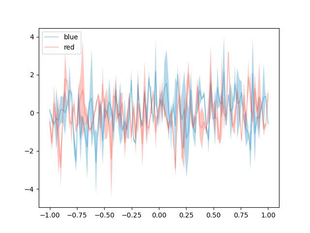 
test__vizualize_colors_test_vizualize_colors.jpg
</td>
</tr><tr>
<td style='text-align: center; padding: 10px;'>
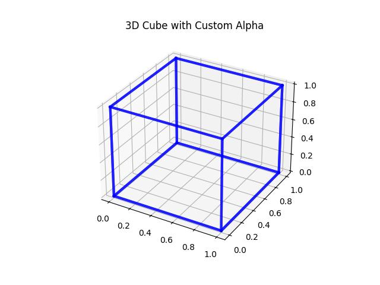 
test__plot_cube_test_plot_cube_with_custom_alpha.jpg
</td>
<td style='text-align: center; padding: 10px;'>
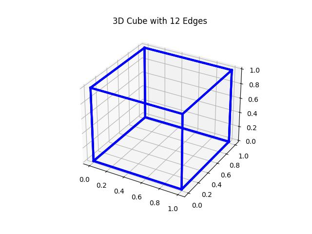 
test__plot_cube_test_plot_cube_creates_12_edges.jpg
</td>
<td style='text-align: center; padding: 10px;'>
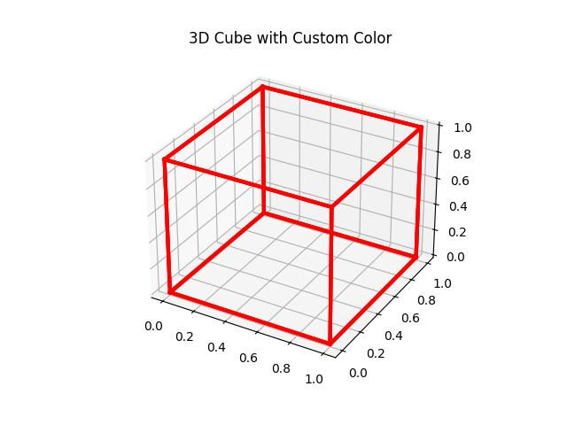 
test__plot_cube_test_plot_cube_with_custom_color.jpg
</td>
<td style='text-align: center; padding: 10px;'>
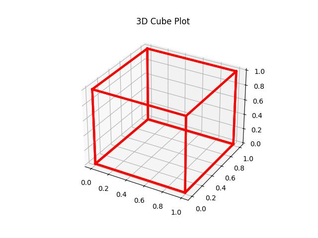 
test__plot_cube.py.jpg
</td>
</tr><tr>
<td style='text-align: center; padding: 10px;'>
 
test__plot_image.py.jpg
</td>
<td style='text-align: center; padding: 10px;'>
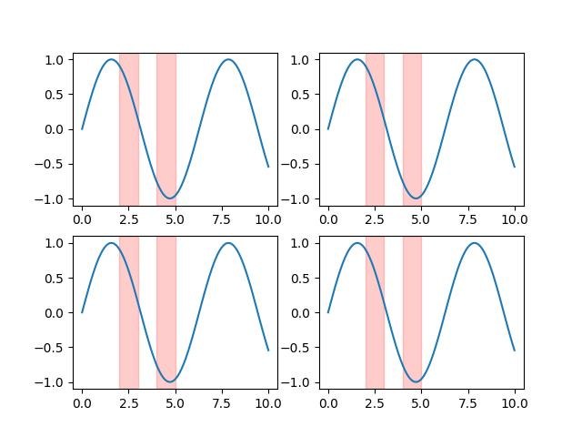 
test__plot_fillv_test_multiple_axes.jpg
</td>
<td style='text-align: center; padding: 10px;'>
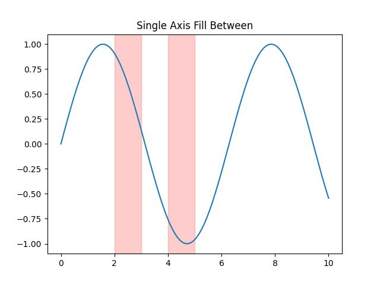 
test__plot_fillv_test_single_axis.jpg
</td>
<td style='text-align: center; padding: 10px;'>
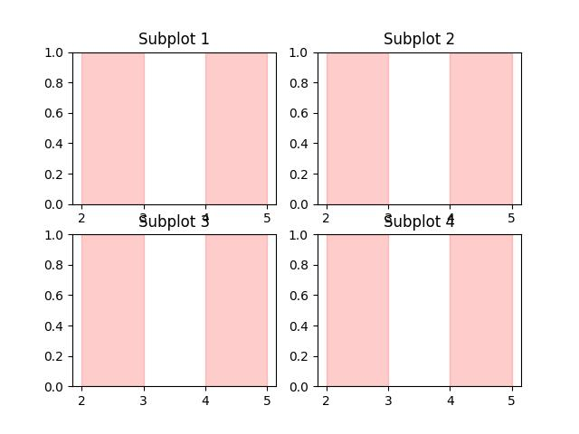 
test__plot_fillv.py.jpg
</td>
</tr><tr>
<td style='text-align: center; padding: 10px;'>
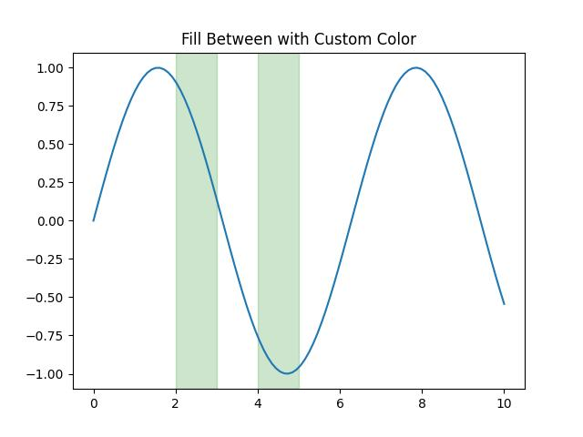 
test__plot_fillv_test_custom_color.jpg
</td>
<td style='text-align: center; padding: 10px;'>
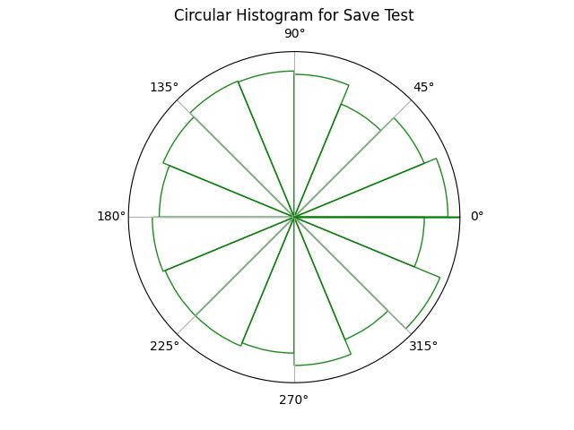 
test__plot_circular_hist.py.jpg
</td>
<td style='text-align: center; padding: 10px;'>
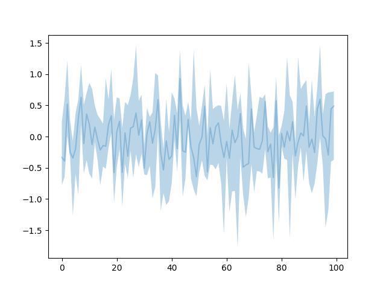 
test__plot_statistical_shaded_line.py.jpg
</td>
<td style='text-align: center; padding: 10px;'>
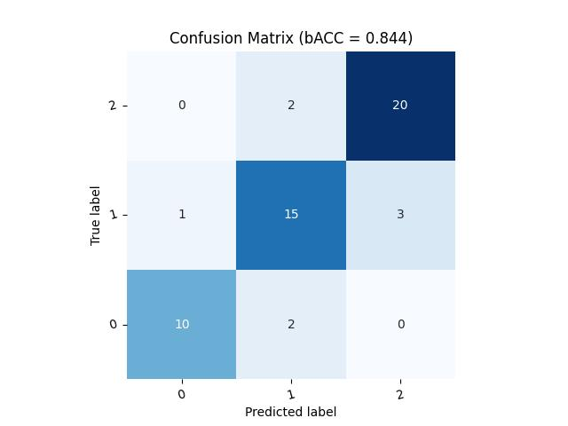 
test__plot_conf_mat_test_return_bacc.jpg
</td>
</tr><tr>
<td style='text-align: center; padding: 10px;'>
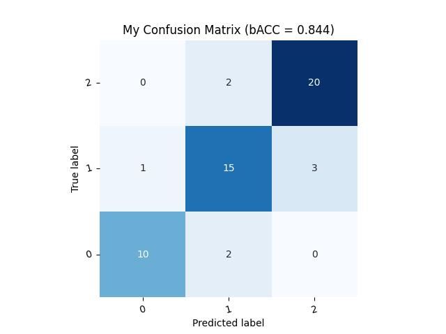 
test__plot_conf_mat_test_custom_title.jpg
</td>
<td style='text-align: center; padding: 10px;'>
 
test__plot_conf_mat_test_with_dataframe.jpg
</td>
<td style='text-align: center; padding: 10px;'>
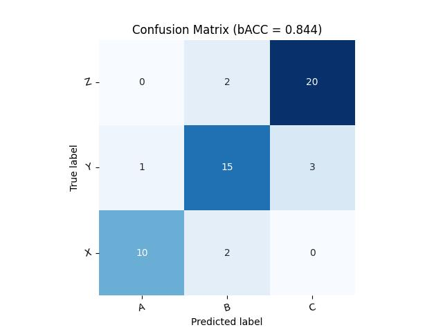 
test__plot_conf_mat_test_with_labels.jpg
</td>
<td style='text-align: center; padding: 10px;'>
 
test__plot_conf_mat.py.jpg
</td>
</tr><tr>
<td style='text-align: center; padding: 10px;'>
 
test__plot_conf_mat_test_basic_functionality.jpg
</td>
<td style='text-align: center; padding: 10px;'>
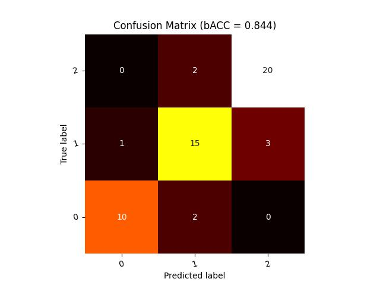 
test__plot_conf_mat_test_custom_cmap.jpg
</td>
<td style='text-align: center; padding: 10px;'>
 
test__plot_raster_test_with_time_parameter.jpg
</td>
<td style='text-align: center; padding: 10px;'>
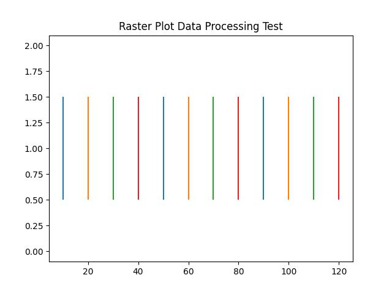 
test__plot_raster_test_data_processing.jpg
</td>
</tr><tr>
<td style='text-align: center; padding: 10px;'>
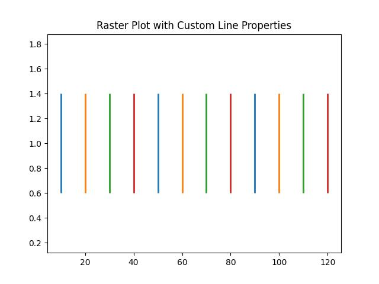 
test__plot_raster_test_with_kwargs.jpg
</td>
<td style='text-align: center; padding: 10px;'>
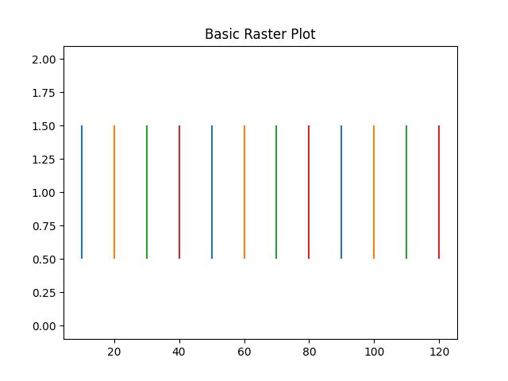 
test__plot_raster_test_basic_functionality.jpg
</td>
<td style='text-align: center; padding: 10px;'>
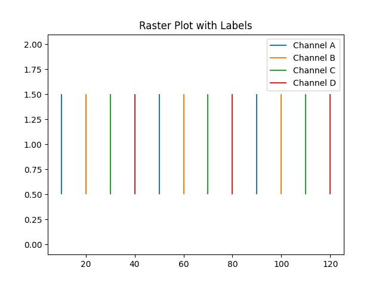 
test__plot_raster_test_with_labels.jpg
</td>
<td style='text-align: center; padding: 10px;'>
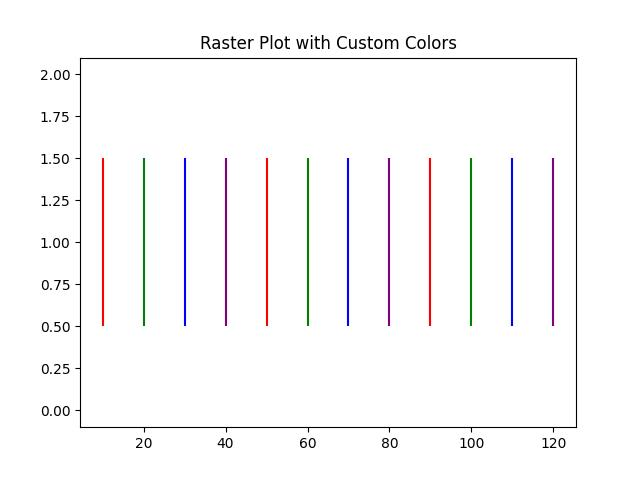 
test__plot_raster_test_with_colors.jpg
</td>
</tr><tr>
<td style='text-align: center; padding: 10px;'>
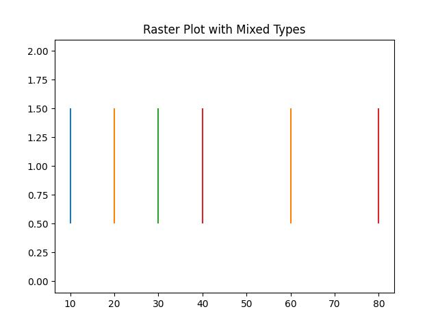 
test__plot_raster_test_with_mixed_types.jpg
</td>
<td style='text-align: center; padding: 10px;'>
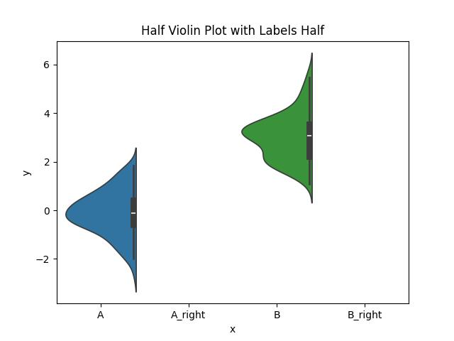 
test__plot_violin_test_with_labels.jpg
</td>
<td style='text-align: center; padding: 10px;'>
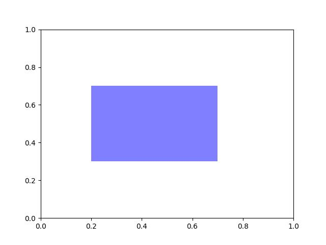 
test__plot_rectangle.py.jpg
</td>
<td style='text-align: center; padding: 10px;'>
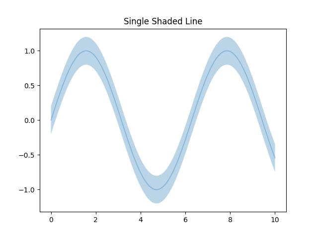 
test__plot_shaded_line_test_plot_single_shaded_line.jpg
</td>
</tr><tr>
<td style='text-align: center; padding: 10px;'>
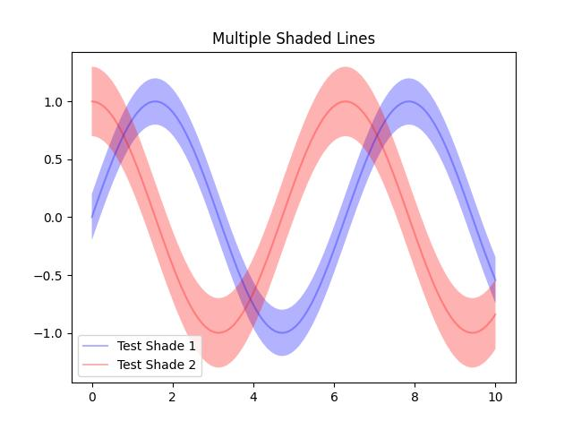 
test__plot_shaded_line_test_plot_multiple_shaded_line.jpg
</td>
<td style='text-align: center; padding: 10px;'>
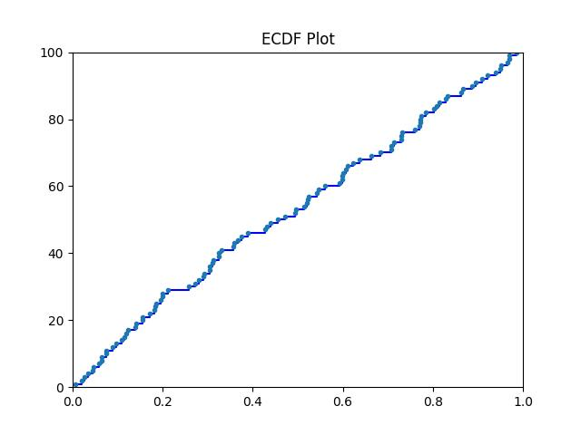 
test__plot_ecdf.py.jpg
</td>
<td style='text-align: center; padding: 10px;'>
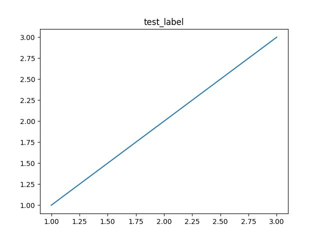 
test__format_label.py.jpg
</td>
<td style='text-align: center; padding: 10px;'>
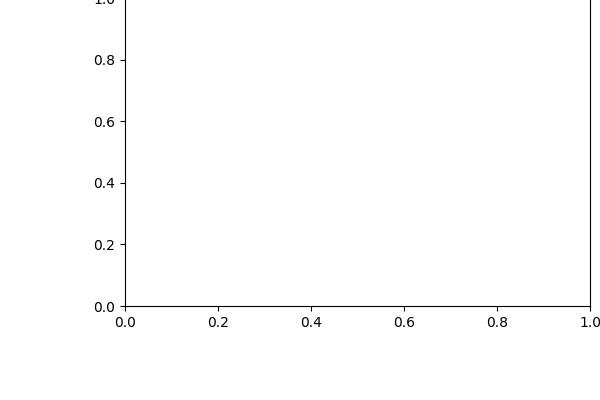 
test__shift.py.jpg
</td>
</tr><tr>
<td style='text-align: center; padding: 10px;'>
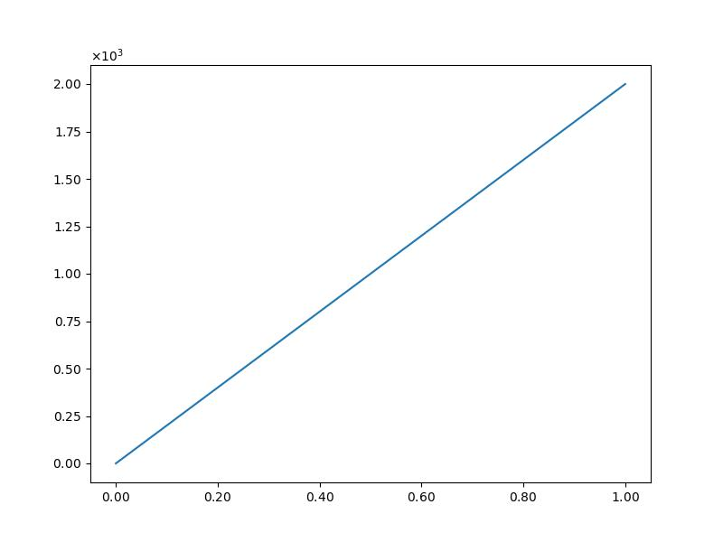 
test__sci_note.py.jpg
</td>
<td style='text-align: center; padding: 10px;'>
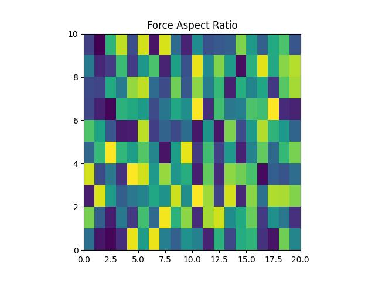 
test__force_aspect.py.jpg
</td>
<td style='text-align: center; padding: 10px;'>
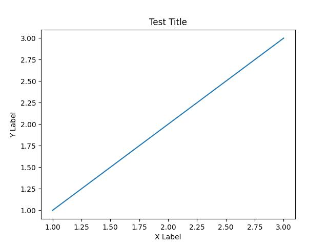 
test__set_xyt.py.jpg
</td>
<td style='text-align: center; padding: 10px;'>
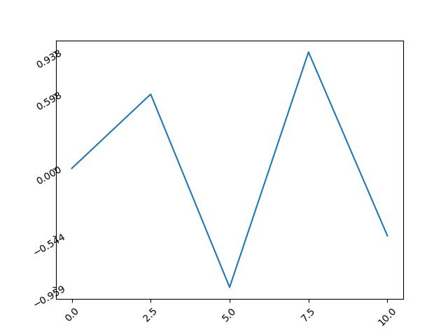 
test__rotate_labels.py.jpg
</td>
</tr><tr>
<td style='text-align: center; padding: 10px;'>
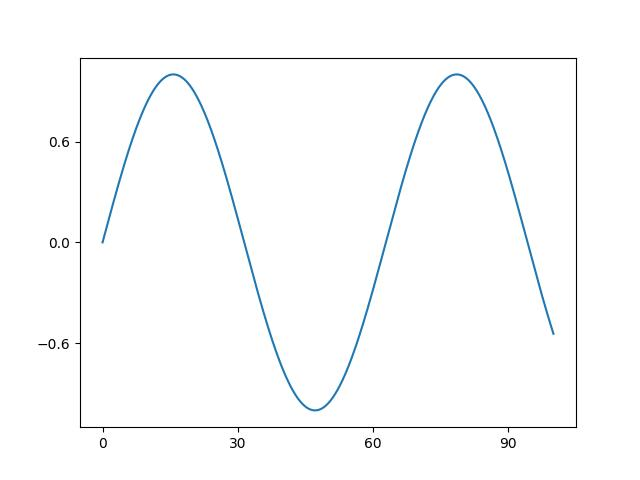 
test__set_n_ticks.py.jpg
</td>
<td style='text-align: center; padding: 10px;'>
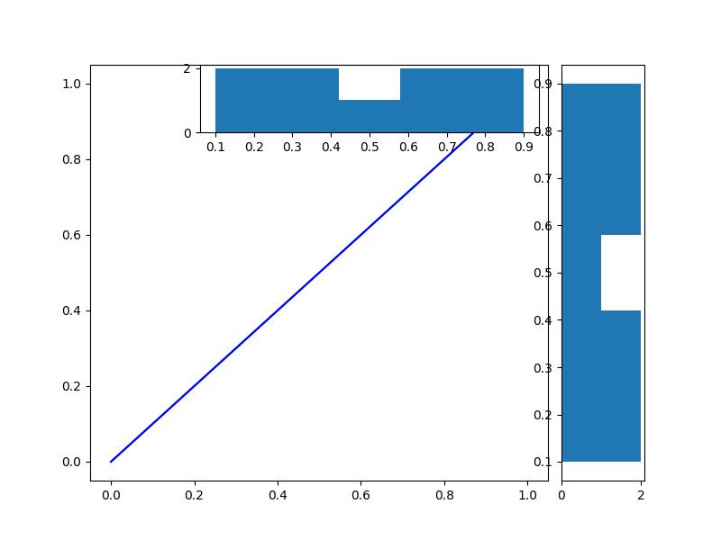 
test__add_marginal_ax.py.jpg
</td>
<td style='text-align: center; padding: 10px;'>
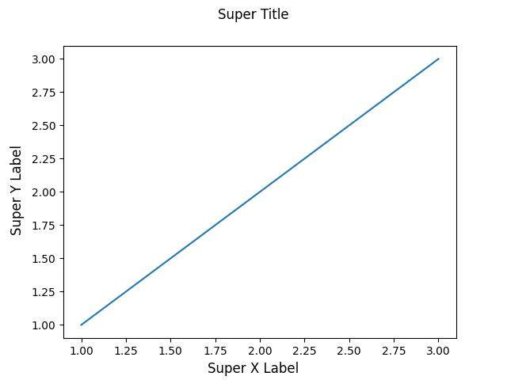 
test__set_supxyt.py.jpg
</td>
<td style='text-align: center; padding: 10px;'>
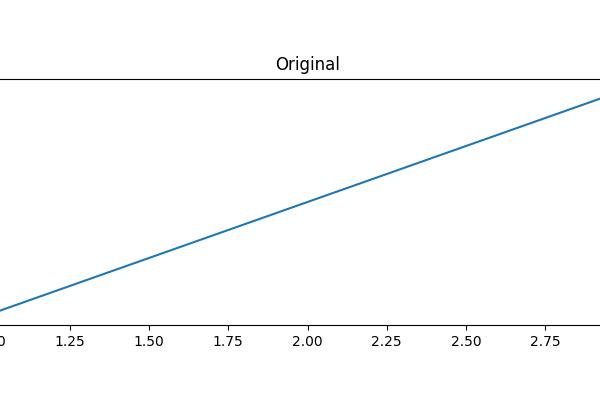 
test__extend.py.jpg
</td>
</tr><tr>
<td style='text-align: center; padding: 10px;'>
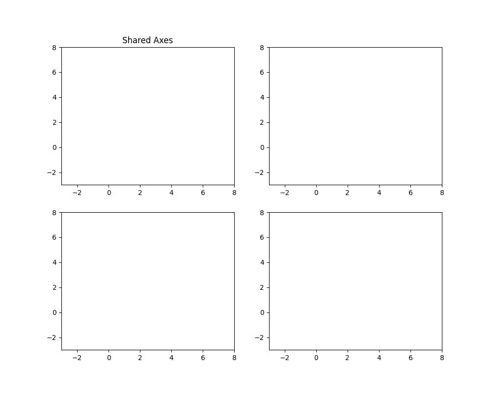 
test__share_axes.py.jpg
</td>
<td style='text-align: center; padding: 10px;'>
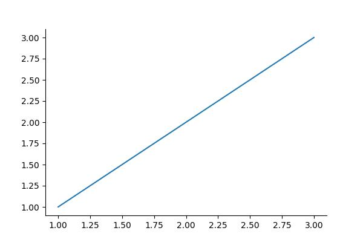 
test__hide_spines.py.jpg
</td>
<td style='text-align: center; padding: 10px;'>
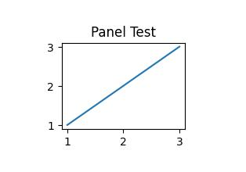 
test__add_panel.py.jpg
</td>
<td style='text-align: center; padding: 10px;'>
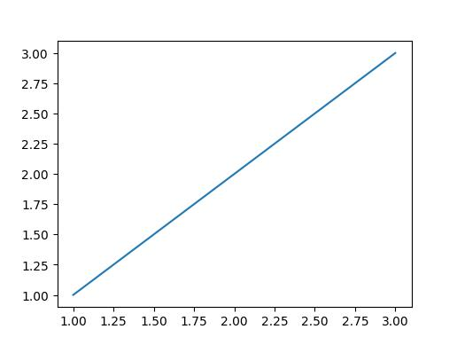 
test__set_size.py.jpg
</td>
</tr><tr>
<td style='text-align: center; padding: 10px;'>
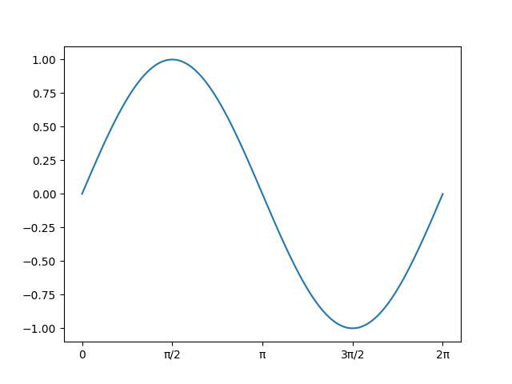 
test__map_ticks.py.jpg
</td>
<td style='text-align: center; padding: 10px;'>
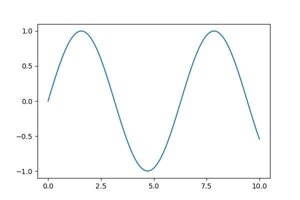 
test__set_ticks.py.jpg
</td>
<td></td>
<td></td>
</tr>
</table>
